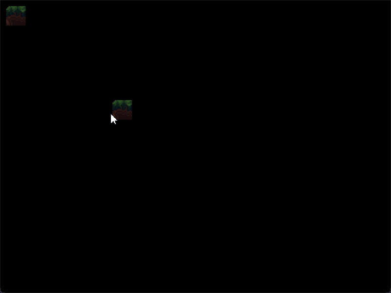

# Platform Game Tech Demo 

This project is a 2D platformer game developed in Python using Pygame. I started it as a way to dive into object-oriented programming (OOP) as well as maybe learn a thing or two about game development. I thought that by coding a game engine from scratch, I'd be able to solidify these concepts much better than using a pre-existing one such as Unreal or Gamemaker.

Right now, the project is more of a tech demo than a full-fledged game—there aren't any real game elements like levels or objectives yet. But underneath the hood, I've built out the core mechanics: physics, movement, animations, particles, and so on. 

Although this ended up being more challenging and time-consuming than I expected, I feel that the whole experience taught me a lot, both about programming and about what goes in making a game. I'm really proud of the progress so far and hope to iterate upon it in the future. 

## Features

### 1. **Object-Oriented Design**
   - The game is structured around OOP principles, with classes representing different entities and components, such as `Game`, `Player`, `PhysicsEntity`, `Tilemap`, `Particle`, and more.
   - Each class encapsulates its functionality, making the code modular, reusable, and easy to maintain.

### 2. **Physics-Based Entity Management**
   - The `PhysicsEntity` class handles the movement and collision detection for game entities.
   - The player character extends this class and includes additional features like jumping, wall sliding, and dashing, all implemented with physics-based interactions.

### 3. **Animation Handling**
   - The game supports smooth animations using the `Animation` class, which manages sprite sequences and transitions between different animation states such as idle, running, jumping, and wall sliding.
   - The animation system is integrated with the entity classes to dynamically update and render the correct frames based on the game state.

### 4. **Particle System**
   - A simple but effective particle system is implemented, allowing for the creation of visual effects such as falling leaves and other particle-based animations.
   - Particles are generated with randomized velocities and directions, adding visual richness to the game.

### 5. **Tilemap and Level Design**
   - The `Tilemap` class manages the game world layout, loading tiles from a JSON file and rendering them efficiently.
   - Supports both grid-based and off-grid tile placements, with collision detection for interactable tiles.

### 6. **Camera and Rendering**
   - A camera system tracks the player’s movement, ensuring the game world scrolls smoothly as the player moves.
   - The rendering system supports multiple layers, with separate surfaces for different game elements like the background, tiles, and entities.

### 7. **Level Editor**

   - You can place, remove, and adjust tiles, designing custom levels from scratch or modifying existing ones.
   - Created levels can be saved as JSON files, which can then be loaded into the main game for playing.

### 8. **Customizable and Expandable**
   - The game's structure allows for easy expansion. New entities, animations, and levels can be added with minimal changes to the existing codebase.
   - The modular design ensures that features like the particle system, camera, and physics can be reused or extended for future projects.

## Getting Started

### Prerequisites
- Python 3.x

### Installation
1. Clone the Repository:
`git clone https://github.com/KKENN-rook/platform-game.git`

2. Navigate to the project directory:
`cd platform-game`

3. Install dependencies:
`pip install -r requirements.txt`  

4. Run the game or level editor:
`python src/platform_game/game.py` or `python src/platform_game/editor.py`
## How To Play

- **Movement:** Use the arrow keys (←, →) to move left and right.
- **Jump:** Press the Spacebar to jump.
- **Dash:** Hold Shift and press a direction key to dash.
- **Wall Slide:** Slide down walls by moving against them while in the air.

### Level Editor 
- **Movement:** WASD to move camera around.
- **Place Tile:** Left Click.
- **Delete Tile:** Right Click.
- **Select tile group:** Scroll wheel.
- **Select tile variant:** Shift + Scroll wheel
- **Switch between grid and non-grid placement:** 'G'.
- **Activate Autotiling:** 'T'.
- **Save map:** 'O'.

## Acknowledgements

- Pygame Community and Documentation
- All Assets were sourced from the Public Domain and are free to use for everyone. 

## Roadmap

- Implement game elements: Objective, Lives, Enemies. 
- Implement Sound effects and music. 
- Allow for multiple stages and stage transitions. 